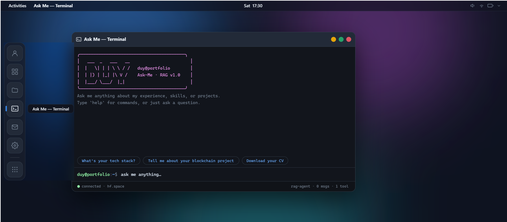
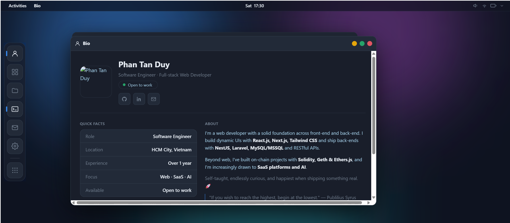
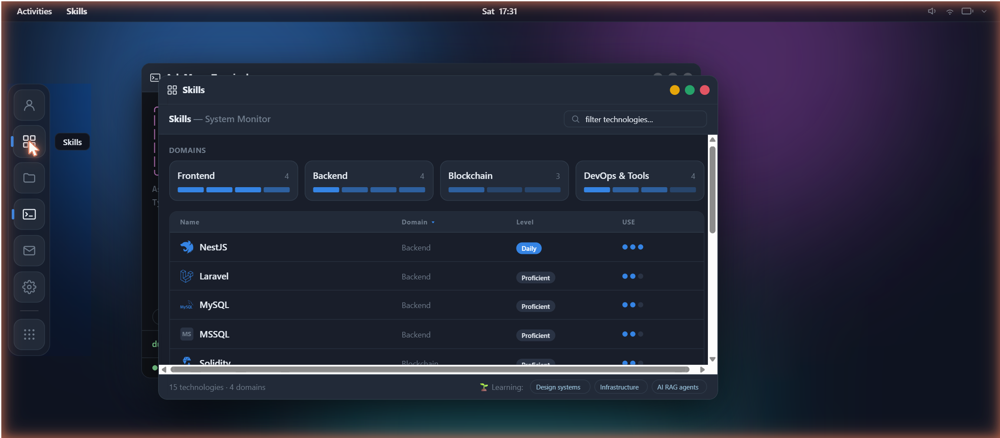
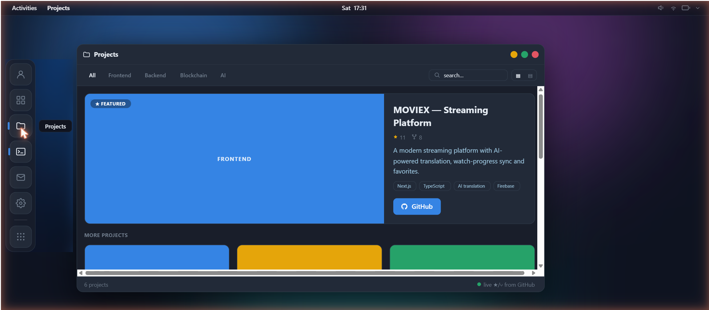
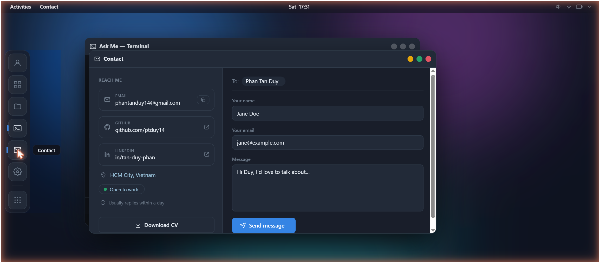
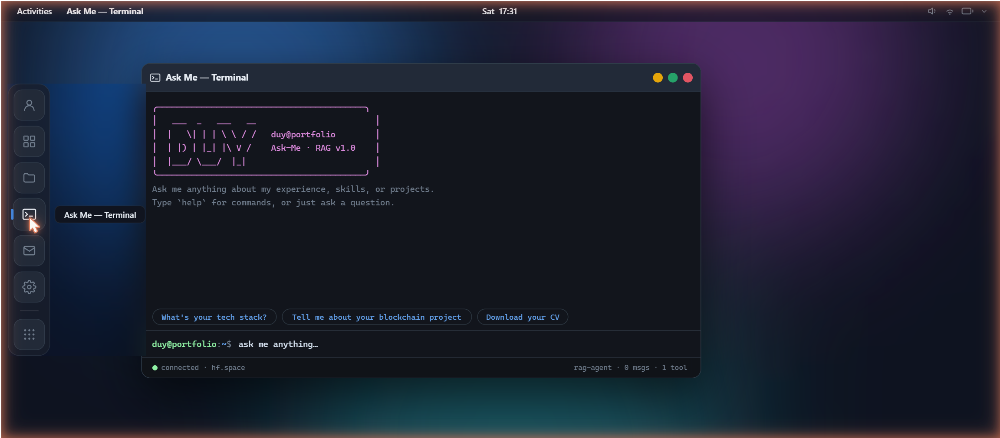
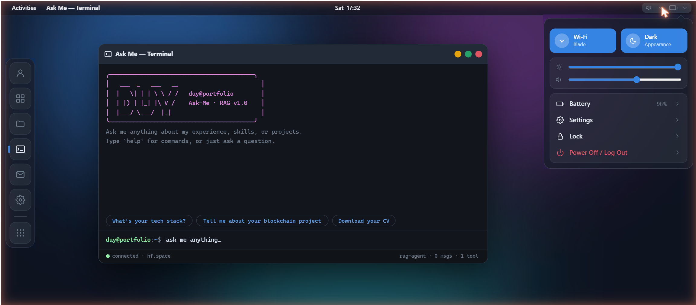

<div align="center">

# Portfolio OS

**A developer portfolio reimagined as a GNOME × macOS hybrid desktop OS**

[](https://reactjs.org/)
[](https://tailwindcss.com/)
[](LICENSE)

*Boot it. Drag windows. Ask me anything.*



</div>

---

## What is this?

Instead of a traditional scrolling portfolio, this is a **fully interactive desktop simulation** running in your browser. It boots with a Linux-style kernel log, has a dock, draggable/resizable windows, a real AI terminal, and persists your wallpaper and theme across reloads — just like a real OS.

Built with React + Tailwind CSS. No Electron, no WebGL — pure DOM.

---

## Features

| | |
|---|---|
| **Boot sequence** | Linux-style kernel log with live GitHub stats fetch, skip-able |
| **Window manager** | Drag, resize (edges + corner), maximize, minimize, multi-window stacking |
| **Ask Me — Terminal** | AI-powered CLI backed by a RAG agent (Hugging Face). Shell commands + free-form questions |
| **5 apps** | Bio · Skills · Projects · Contact · Settings |
| **GNOME × macOS chrome** | Left dock · top panel with focused app name · macOS traffic lights |
| **Vibrancy materials** | Frosted glass dock/panel/Control Center (`backdrop-filter: blur`) |
| **Control Center** | Brightness + volume sliders · Wi-Fi + Dark mode toggles · Lock / Power Off |
| **Theme engine** | Dark / Light toggle · 6 accent swatches · wallpaper library · persist to `localStorage` |
| **Wallpaper library** | 6 curated SVG art pieces · 6 solid colors · upload your own image |
| **Lock screen** | Avatar + clock, triggered from Control Center |
| **Mobile shell** | Phone-OS layout for viewports < 768 px — tap icons → full-screen app + back button |
| **Custom cursors** | Hand-crafted SVG arrow, pointer, and I-beam cursors |

---

## Screenshots

<table>
  <tr>
    <td align="center"><br/><sub><b>Bio</b> — Quick Facts + narrative</sub></td>
    <td align="center"><br/><sub><b>Skills</b> — System Monitor, 15 technologies</sub></td>
  </tr>
  <tr>
    <td align="center"><br/><sub><b>Projects</b> — Featured hero + bento grid, live GitHub ★</sub></td>
    <td align="center"><br/><sub><b>Contact</b> — Mail compose with EmailJS</sub></td>
  </tr>
  <tr>
    <td align="center"><br/><sub><b>Ask Me</b> — RAG agent terminal</sub></td>
    <td align="center"><br/><sub><b>Control Center</b> — macOS-style quick settings</sub></td>
  </tr>
</table>

---

## Tech Stack

| Layer | Technology |
|---|---|
| **UI framework** | React 18 (Create React App) |
| **Styling** | Tailwind CSS v3 + custom design tokens (CSS variables) |
| **Typography** | Inter · JetBrains Mono — self-hosted via `@fontsource` |
| **Icons** | Custom symbolic SVG icons (Adwaita style) · Simple Icons (skill logos, tree-shaken) |
| **AI / Terminal** | Hugging Face Spaces RAG agent endpoint |
| **Contact form** | EmailJS |
| **GitHub data** | GitHub REST API — live star/fork/repo counts fetched on boot |
| **State** | `useReducer` (window manager) · `useContext` (system, theme, terminal) · `localStorage` (persist) |

---

## Getting Started

### 1. Clone & install

```bash
git clone https://github.com/ptduy14/portfolio.git
cd portfolio
npm install
```

### 2. Environment variables

Create a `.env` in the project root (contact form — optional, degrades gracefully without it):

```env
REACT_APP_EMAILJS_SERVICE_ID=your_service_id
REACT_APP_EMAILJS_TEMPLATE_ID=your_template_id
REACT_APP_EMAILJS_PUBLIC_KEY=your_public_key
```

Get these from [EmailJS](https://www.emailjs.com/) → Email Services + Email Templates.

### 3. Run

```bash
npm start        # development — http://localhost:3000
npm run build    # production build
```

---

## Project Structure

```
src/
├── desktop/
│   ├── Desktop.jsx             # Root: wallpaper + shell + window layer
│   ├── DesktopProvider.jsx     # Window manager (OPEN/CLOSE/FOCUS/MOVE/RESIZE/TOGGLE_MAX/MINIMIZE)
│   ├── SystemProvider.jsx      # OS state: wallpaper, brightness, volume, accent, GitHub stats
│   ├── BootScreen.jsx          # Linux kernel boot log animation
│   ├── LockScreen.jsx          # Clock + avatar lock screen
│   ├── shell/
│   │   ├── TopPanel.jsx        # Activities · focused app name · clock · tray
│   │   ├── Dock.jsx            # Left dock — bounce on launch, running indicator
│   │   ├── Window.jsx          # Draggable/resizable chrome + macOS traffic lights
│   │   ├── QuickSettings.jsx   # macOS Control Center dropdown
│   │   ├── Overview.jsx        # GNOME Activities overlay with app search
│   │   └── icons.jsx           # Symbolic SVG icon set (Adwaita style)
│   ├── apps/
│   │   ├── BioApp.jsx          # About This Developer — avatar, quick facts, narrative
│   │   ├── SkillsApp.jsx       # System Monitor — domain meters + sortable process table
│   │   ├── ProjectsApp.jsx     # Featured hero + bento grid, live GitHub stats
│   │   ├── ContactApp.jsx      # Mail compose + EmailJS send
│   │   ├── TerminalApp.jsx     # AI terminal — local commands + RAG agent streaming
│   │   └── SettingsApp.jsx     # Wallpaper / Appearance / Sound / About
│   └── mobile/
│       └── MobileShell.jsx     # Phone OS layout (< 768 px)
├── context/
│   ├── ThemeContext.jsx        # Dark / Light mode
│   └── ToastContext.jsx        # macOS-style notification toasts
└── services/
    └── chatbotService.js       # Hugging Face RAG agent fetch
```

---

## Design Notes

Inspired by **GNOME Adwaita** (structure, behavior) and **macOS** (visual refinement):

- **No gradient spam** — all UI chrome uses flat token colors
- **Vibrancy** — `backdrop-filter: blur` on dock, panel, and Control Center (solid fallback)
- **Design tokens** — `--bg-wall/panel/window/surface`, `--accent`, `--text/text-body/text-dim`, `--r-window/card/icon/control`
- **Motion** — spring `cubic-bezier(.34,1.56,.64,1)` for window open; `prefers-reduced-motion` respected everywhere

---

## Author

**Phan Tan Duy** · Software Engineer · Full-stack Web Developer · HCM City, Vietnam

[](https://github.com/ptduy14)
[](https://linkedin.com/in/tan-duy-phan-6087a1311)
[](mailto:phantanduy14@gmail.com)

---

> *"If you wish to reach the highest, begin at the lowest." — Publilius Syrus*
